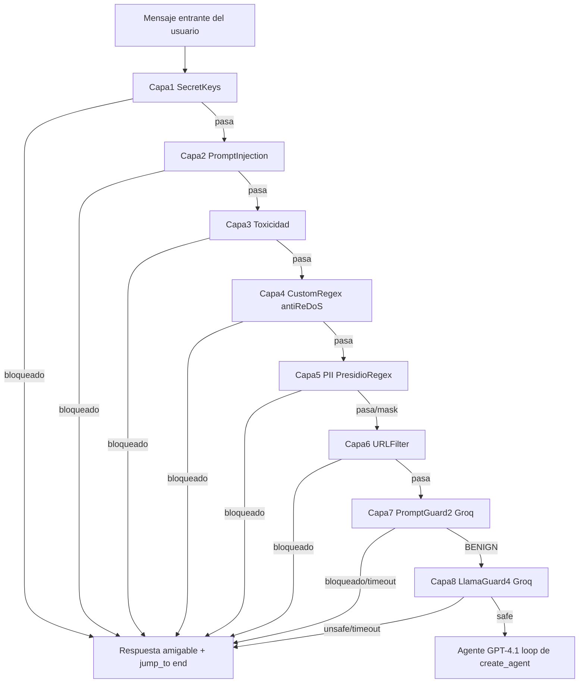

# InputGuardrail — Pipeline de validación de entrada de 8 capas

> Implementación de la HU [`SEC-001`](HUs/HU_InputGuardrail.md): todo mensaje entrante pasa por un pipeline secuencial de 8 capas de seguridad **antes** de llegar al agente (GPT-4.1 vía `create_agent`), para evitar prompt injection, jailbreaks, fuga de credenciales, contenido tóxico, fuga de PII y phishing.

## Índice

- [Arquitectura general](#arquitectura-general)
- [Reglas de oro del pipeline](#reglas-de-oro-del-pipeline)
- [Las 8 capas](#las-8-capas)
- [Configuración](#configuración)
- [Variables de entorno](#variables-de-entorno)
- [Observabilidad](#observabilidad)
- [Tests](#tests)
- [Cómo agregar/editar reglas sin tocar código](#cómo-agregarEditar-reglas-sin-tocar-código)

---

## Arquitectura general

El pipeline se implementa como una cadena de **middlewares de LangChain** (`AgentMiddleware`, hooks `before_agent` / `abefore_agent`) que se pasa a `create_agent(..., middleware=[...])` en [`src/services/agent_service.py`](src/services/agent_service.py). LangChain ejecuta los hooks en el **orden exacto** en que aparecen en la lista, y si alguno retorna `{"jump_to": "end", ...}` el resto de capas **no se ejecuta** (cortocircuito nativo, sin lógica de orquestación adicional).



Todo el código vive en [`src/services/guardrails/`](src/services/guardrails/):

```
src/services/guardrails/
├── __init__.py                 # build_input_guardrails(): construye las 8 capas en orden fijo
├── common.py                   # hash_message, log_block, block_result, load_yaml_config, get_latest_human_text
├── layer1_secrets.py
├── layer2_prompt_injection.py
├── layer3_toxicity.py
├── layer4_custom_regex.py
├── layer5_pii.py
├── layer6_url_filter.py
├── layer7_prompt_guard.py
└── layer8_llama_guard.py

config/guardrails/               # Configuración versionada (editable sin tocar código)
├── prompt_injection_patterns.yaml
├── toxicity_patterns.yaml
├── custom_patterns.yaml
├── pii_strategies.yaml
├── url_blocklist.yaml
└── llama_guard_categories.yaml
```

## Reglas de oro del pipeline

Estas reglas están garantizadas por el diseño (no por convención):

- **Orden estricto 1→8**: viene dado por el orden de la lista que retorna `build_input_guardrails()`; nunca se ejecutan en paralelo.
- **Cortocircuito (fail-fast)**: cualquier capa que detecta una violación retorna `jump_to: "end"` y ninguna capa posterior se ejecuta.
- **Cero excepciones**: `build_input_guardrails()` siempre construye las 8 capas completas. No existe ningún flag, variable de entorno o parámetro de "modo debug" que permita saltarse una capa.
- **Fail-close en capas 7 y 8**: si Groq no responde dentro del timeout (`GROQ_TIMEOUT_SECONDS`) o lanza cualquier error, el mensaje se **bloquea** (nunca se deja pasar por error de conexión).
- **Auditoría sin fuga de datos**: cada bloqueo se registra vía `log_block()` con la capa, el motivo y un **hash SHA-256** del mensaje — nunca el texto plano (que podría contener secretos o PII).
- **Mensajes de bloqueo amigables**: el usuario nunca ve un stack trace ni el motivo técnico exacto del bloqueo.
- **Importante — validación del mensaje "actual"**: como `AgentService.chat` antepone el historial de la conversación a `messages` en cada invocación (no hay `checkpointer`), todas las capas validan el **último** mensaje humano de la lista (`get_latest_human_text` / `get_latest_human_message` en `common.py`), nunca el primero.

## Las 8 capas

### Capa 1 — Secret Keys (`layer1_secrets.py`)

| | |
|---|---|
| **Objetivo** | Detectar credenciales filtradas (API keys, tokens) antes de que queden en logs/BD. |
| **Tipo** | Determinista (REGEX) |
| **Dependencia externa** | Ninguna — instantánea |
| **Patrones** | `sk-[a-zA-Z0-9]{20,}`, `sk-proj-*`, `ghp_*`/`gho_*`/`github_pat_*`, `AKIA[A-Z0-9]{16}`, JWT (`eyJ...`), `Bearer <token>` |
| **Mensaje de bloqueo** | *"Tu mensaje parece contener una clave de API o token secreto..."* |
| **Config** | Patrones hardcodeados (son universales, no varían por negocio) |

### Capa 2 — Prompt Injection (`layer2_prompt_injection.py`)

| | |
|---|---|
| **Objetivo** | Interceptar instrucciones disfrazadas que intenten sobrescribir el comportamiento del agente. |
| **Tipo** | Determinista (REGEX), `re.IGNORECASE \| re.MULTILINE \| re.DOTALL` |
| **Dependencia externa** | Ninguna |
| **Categorías (≥60 patrones ES/EN)** | **Sobrescritura** (`<<SYS>>`, `[SYSTEM]`), **Amnesia** (*"ignora todas las instrucciones anteriores"*), **Jailbreak** (*"modo DAN"*, *"modo desarrollador"*), **Extracción** (*"revela tu system prompt"*), **Reconocimiento** (*"qué base de datos usas"*) |
| **Config** | [`config/guardrails/prompt_injection_patterns.yaml`](config/guardrails/prompt_injection_patterns.yaml) |

### Capa 3 — Toxicidad (`layer3_toxicity.py`)

| | |
|---|---|
| **Objetivo** | Bloquear odio, amenazas, acoso o autolesión. |
| **Tipo** | Determinista (REGEX) |
| **Categorías (5)** | Amenazas directas, discurso de odio, acoso sexual, incitación a la violencia, autolesión |
| **Caso especial: autolesión** | En vez de un rechazo seco, responde con un **mensaje de contención** (línea de ayuda de salud mental de Perú). Este texto es un **placeholder configurable**; el canal de derivación real queda pendiente de definir con Producto. |
| **Config** | [`config/guardrails/toxicity_patterns.yaml`](config/guardrails/toxicity_patterns.yaml) (incluye el bloque `respuestas`) |

### Capa 4 — Custom Regex & Anti-ReDoS (`layer4_custom_regex.py`)

| | |
|---|---|
| **Objetivo** | Reglas de negocio personalizables (ej. bloquear menciones de competidores) sin exponerse a ataques ReDoS. |
| **Tipo** | Determinista, librería `regex` (no `re` estándar) |
| **Protección anti-ReDoS** | Cada regla corre con `timeout=CUSTOM_REGEX_TIMEOUT_SECONDS` (default 1s). Si una regla individual excede el timeout, se captura `TimeoutError`, se loguea el incidente y **se continúa** con las siguientes reglas/capas — el servicio nunca se cae. |
| **Config** | [`config/guardrails/custom_patterns.yaml`](config/guardrails/custom_patterns.yaml) — cada regla define `name`, `pattern`, `reason` y `message` |
| **Test de ReDoS** | `tests/guardrails/test_layer4_custom_regex.py::test_catastrophic_regex_times_out_without_hanging_the_service` usa el patrón catastrófico conocido `(a+)+$` |

### Capa 5 — Detección de PII (`layer5_pii.py`)

| | |
|---|---|
| **Objetivo** | Detectar/tratar datos personales (DNI, RUC, teléfono, email, tarjetas) antes de que lleguen al agente o queden en logs. |
| **Motor principal** | Microsoft **Presidio** (`AnalyzerEngine`) + spaCy `es_core_news_sm`, `score_threshold=0.6` |
| **Motor fallback** | Si Presidio/spaCy no están instalados o fallan al inicializar (`try/except` en el constructor), se activa automáticamente un detector **100% REGEX local** equivalente, sin interrumpir el servicio |
| **Entidades PE custom** | `DNI_PE` (8 dígitos exactos), `RUC_PE` (inicia en `10`/`15`/`17`/`20` + 9 dígitos), `PHONE_PE` (`+51 9XXXXXXXX` o `9XXXXXXXX`) |
| **Estrategia por entidad** | `block` (rechaza), `mask` (oculta parcialmente, ej. `98******1`), `off` (desactivado) — configurable por entidad |
| **Privacidad** | Procesamiento 100% local; el mensaje nunca se envía a un servicio externo en esta capa |
| **Config** | [`config/guardrails/pii_strategies.yaml`](config/guardrails/pii_strategies.yaml) |

### Capa 6 — Filtro de URLs / Anti-Phishing (`layer6_url_filter.py`)

| | |
|---|---|
| **Objetivo** | Bloquear enlaces sospechosos (phishing, prompt injection indirecto vía contenido web enlazado). |
| **Tipo** | Determinista (REGEX) |
| **Detecta** | URLs con protocolo (`http://`, `https://`, `ftp://`), dominios "pelados" (sin protocolo, ej. `promo-academia.pe`), y acortadores conocidos (`bit.ly`, `t.co`, etc.) **independientemente de su TLD** |
| **Cobertura** | ≥60 TLDs relevantes (`.pe`, `.mx`, `.gob.pe`, ...) y ≥20 acortadores |
| **Config** | [`config/guardrails/url_blocklist.yaml`](config/guardrails/url_blocklist.yaml) |

### Capa 7 — Llama Prompt Guard 2 (`layer7_prompt_guard.py`)

| | |
|---|---|
| **Objetivo** | Segundo filtro **semántico** para detectar ataques que evaden el REGEX (faltas de ortografía intencionales, redacción creativa, otros idiomas). |
| **Tipo** | Modelo (clasificador ligero) |
| **Modelo** | `meta-llama/Llama-Prompt-Guard-2-86M` vía **Groq API**, `temperature=0.0` |
| **Salida** | `MALICIOUS` (bloquea) / `BENIGN` (pasa a Capa 8) |
| **Ventana de contexto** | Mensajes largos se segmentan en ventanas de ≤512 tokens (aprox. por caracteres) y se evalúan **en paralelo** con `asyncio.gather` |
| **Fail-close** | Timeout (`GROQ_TIMEOUT_SECONDS`) o cualquier error de Groq → el mensaje se **bloquea** |

### Capa 8 — Llama Guard 4 (`layer8_llama_guard.py`)

| | |
|---|---|
| **Objetivo** | Análisis semántico **profundo** contra la taxonomía de seguridad estándar MLCommons, como última línea de defensa antes del agente. |
| **Tipo** | Modelo (clasificador profundo) |
| **Modelo** | `meta-llama/Llama-Guard-4-12B` vía **Groq API** |
| **Salida** | `safe` o `unsafe\n[categoría]` (S1 Violent Crimes, S4 Child Exploitation, S6 Specialized Advice, S7 Privacy, S9 Indiscriminate Weapons, S10 Hate, S13 Elections, entre otras) |
| **`skip_categories`** | Configurable en YAML para omitir una categoría específica según el caso de uso comercial, sin tocar código |
| **Fail-close** | Igual que la Capa 7 |
| **Config** | [`config/guardrails/llama_guard_categories.yaml`](config/guardrails/llama_guard_categories.yaml) |

## Configuración

Todos los patrones/listas/estrategias viven en `config/guardrails/*.yaml`, versionados en git y editables por el equipo de negocio **sin tocar código Python**:

| Archivo | Usado por |
|---|---|
| `prompt_injection_patterns.yaml` | Capa 2 |
| `toxicity_patterns.yaml` | Capa 3 |
| `custom_patterns.yaml` | Capa 4 |
| `pii_strategies.yaml` | Capa 5 |
| `url_blocklist.yaml` | Capa 6 |
| `llama_guard_categories.yaml` | Capa 8 |

## Variables de entorno

Ver [`.env.example`](.env.example). Nuevas variables agregadas para esta HU:

| Variable | Default | Descripción |
|---|---|---|
| `GROQ_API_KEY` | *(obligatoria)* | API key de [Groq Console](https://console.groq.com/keys), usada por las capas 7 y 8 |
| `GROQ_PROMPT_GUARD_MODEL` | `meta-llama/Llama-Prompt-Guard-2-86M` | Modelo de la Capa 7 |
| `GROQ_LLAMA_GUARD_MODEL` | `meta-llama/Llama-Guard-4-12B` | Modelo de la Capa 8 |
| `GROQ_TIMEOUT_SECONDS` | `3` | Timeout de fail-close para las capas 7-8 |
| `CUSTOM_REGEX_TIMEOUT_SECONDS` | `1` | Timeout anti-ReDoS por regla en la Capa 4 |

> **Importante:** si `GROQ_API_KEY` está vacío o Groq no responde, las capas 7 y 8 bloquearán **todos** los mensajes (fail-close intencional). Las capas 1-6 (REGEX/Presidio) siguen operando de forma 100% autónoma sin Groq.

## Observabilidad

No se implementó un endpoint `/metrics` (decisión de alcance de esta iteración). En su lugar:

- Cada bloqueo se registra con `log_block()` (`src/services/guardrails/common.py`) en el logger JSON del proyecto (`src/utils/logger.py`), incluyendo `guardrail_layer`, `message_hash`, `block_reason` y un contador acumulado en memoria (`layer_block_count`).
- Estos logs estructurados pueden alimentar un dashboard (ej. agregando por `guardrail_layer` en el sistema de logs) sin cambios adicionales de código.

## Tests

```bash
pip install -r requirements.txt
python -m spacy download es_core_news_sm   # opcional: solo si se quiere probar Presidio real
pytest
```

La suite (`tests/guardrails/`) cubre las 8 capas, incluyendo:

- El caso de regex catastrófico `(a+)+$` para la Capa 4 (anti-ReDoS).
- Fail-close mockeado (error y timeout de Groq) para las Capas 7 y 8.
- Fallback automático a REGEX cuando Presidio no está disponible (Capa 5).
- Orden fijo e inmutable de las 8 capas (`test_pipeline.py`).

## Cómo agregar/editar reglas sin tocar código

- **Nueva palabra prohibida / patrón de negocio** → edita `config/guardrails/custom_patterns.yaml` (Capa 4).
- **Nuevo patrón de prompt injection/toxicidad** → edita el YAML correspondiente (Capas 2/3).
- **Nuevo TLD o acortador a bloquear** → `url_blocklist.yaml` (Capa 6).
- **Cambiar estrategia de una entidad PII** (ej. de `block` a `mask`) → `pii_strategies.yaml` (Capa 5).
- **Omitir una categoría de Llama Guard** para un caso de uso comercial → `skip_categories` en `llama_guard_categories.yaml` (Capa 8).

En todos los casos, **no se requiere modificar ni redeployar código Python** — solo actualizar el YAML correspondiente.
